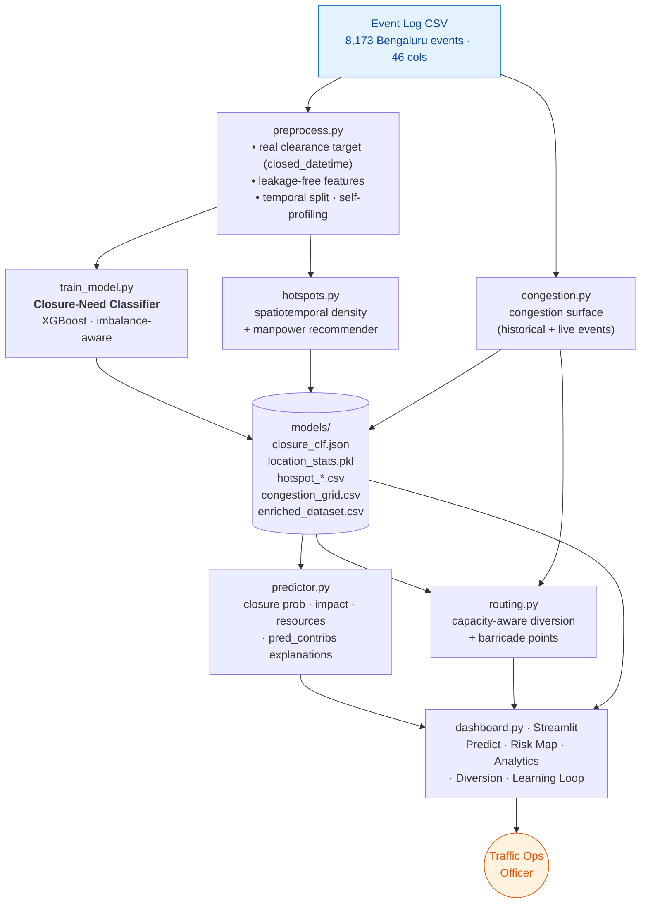

# 🚦 Gridlock Oracle

**Event-driven congestion intelligence for Bengaluru traffic operations.**
Predicts which incoming incidents will require a road closure, forecasts where and when
events cluster, and generates **capacity-aware** diversion routes that avoid creating a
second jam — turning experience-driven traffic response into data-driven decisions.

> Flipkart GRiD — Theme 2: *Event-Driven Congestion (Planned & Unplanned)*
> *"Use historical and real-time data to forecast event-related traffic impact and
> recommend optimal manpower, barricading, and diversion plans."*

---

## The story behind the model (why this is honest, not hand-wavy)

We started where most teams would: **predict how long an incident takes to clear.** The
data refused to support it — the columns that would drive clearance time
(`reason_breakdown`, `cargo_material`, `age_of_truck`) are **97% empty**, and an honest
temporal-split model scored **R² ≈ 0**. Rather than ship a model with a suspiciously
perfect score that collapses under questioning, we tested *what the data can actually
predict* and pivoted on the evidence:

| We tested… | Result | Decision |
| --- | --- | --- |
| Clearance-time regression | R² ≈ 0 (no signal) | ❌ dropped as a prediction; kept as a *descriptive* stat |
| Clearance buckets (fast/med/slow) | ≈ baseline | ❌ dropped |
| **Road-closure need (classification)** | **PR-AUC 3.3× baseline** | ✅ **headline model** |

That arc — *tested honestly → pivoted on evidence → validated the real signal* — is the
backbone of the solution.

---

## What it does — three pillars, mapped to the theme

| Theme requirement | Our component | Status |
| --- | --- | --- |
| **Barricading** | Closure-need classifier → P(road closure) per incoming event | ✅ validated (ROC-AUC 0.72, PR-AUC 3.3× lift) |
| **Manpower** | Spatiotemporal hotspot analytics → deployment recommender | ✅ descriptive, on 8,173 events |
| **Diversion** | **Capacity-aware** routing → routes around congestion, not into it | ✅ differentiator |

---

## Architecture



---

## Key results (temporal hold-out — honest forecasting setup)

**Closure-need classifier**
- Dataset: 8,173 events → **2,724** with clean targets after cleaning
- Split: **temporal** (oldest 2,179 train / newest 545 test) — no peeking at the future
- Positive rate: **10.5%** (imbalanced)
- **ROC-AUC: 0.72** · **PR-AUC: 0.348 vs 0.105 baseline = 3.3× lift**
- Operating point @0.30: flag **17%** of events, catch **~47%** of all closures
- Top drivers: `event_cause`, `police_station`, `veh_type`

**Hotspots** — 8,173 events; busiest junction and peak hours surfaced for deployment.

**Congestion surface** — 8,173 geocoded events → **1,294 cells** (~440 m); hottest cell
at **(12.980, 77.604)**, central Bengaluru.

> We quote **PR-AUC lift** as the headline because ROC-AUC is misleading on a 10.5%-positive
> problem. We deliberately **exclude** closure-derived location features to keep the
> classifier free of target leakage — 3.3× lift comes from event attributes alone.

---

## Methodology — the rigor that survives Q&A

- **Real target, not an invented score.** Clearance/closure labels come from the data
  (`closed_datetime − start_datetime`), never a formula we made up and trained a model to copy.
- **Leakage-free features.** Nothing derived from `end/closed/resolved_datetime` or `status`
  is used as an input — those are only known *after* an event ends.
- **Temporal split.** Train on the past, test on the future, so metrics reflect real
  forecasting (a random split would let the model peek ahead).
- **Train-only aggregates** with a junction → zone → global fallback for cold-start locations.
- **Self-profiling features.** Columns auto-skip when too sparse (e.g. `reason_breakdown` at 3%).
- **Honest baselines** (global mean, per-type, priority rule) so every metric has a reference.
- **Capacity-aware routing.** Road cost = `length × (1 + 2.5 × congestion)`; routes ranked by
  `distance × (1 + 1.5 × congestion)` — the diversion avoids already-choked corridors.
- **Explainability** via XGBoost `pred_contribs` (SHAP-style, categorical-safe, no extra deps).

---

## Project structure

```
gridlock-oracle/
├── utils/
│   └── preprocess.py        cleaning, real target, leakage-free features, temporal split
├── data/                    event log CSV lives here
├── models/                  generated artifacts (model, stats, lookups, grids)
├── train_model.py           trains the closure-need classifier
├── predictor.py             single-event inference: prob · impact · resources · explain
├── hotspots.py              spatiotemporal density + manpower recommender
├── congestion.py            congestion surface for capacity-aware routing
├── routing.py               capacity-aware diversion routes + barricade points
├── routing_page.py          Streamlit component for the Diversion page (in-process, no API)
├── dashboard.py             Streamlit app — 5 pages
└── requirements.txt
```

---

## Setup & run

```bash
pip install -r requirements.txt

# 1) build artifacts (order matters)
python train_model.py --data data/flipkart_gridlock.csv     # closure classifier
python hotspots.py    --data data/flipkart_gridlock.csv     # deployment hotspots
python congestion.py  --data data/flipkart_gridlock.csv     # congestion surface

# 2) (optional, recommended for the demo) cache the real Bengaluru road network
python routing.py --download

# 3) launch the dashboard (single self-contained process — no API server needed)
streamlit run dashboard.py
```

**Dashboard pages**
1. **Predict Event** — closure-probability gauge, impact tier, barricade/manpower plan, "why" explanation
2. **Risk Map** — zone × hour hotspot heatmap + junction leaderboard
3. **Analytics** — temporal / cause / closure-rate charts (clearance shown as *descriptive*)
4. **Diversion & Barricades** — capacity-aware routes + barricade map
5. **Learning Loop** — logs "was a closure actually needed?" for future retraining

---

## Tech stack

Python · XGBoost · Streamlit · Plotly · Folium · OSMnx · NetworkX · Pandas / NumPy ·
scikit-learn

---

## Honest limitations

- **Clearance time is not predictable** from this dataset; we present it only as a
  descriptive historical average, never a forecast.
- **Closure recall is moderate** (~47% at our operating point) — this is decision *support*
  that focuses attention, a 3.3× improvement over reactive patrolling, not an oracle.
- **Live congestion awareness** is strongest when a timestamp is supplied; the structural
  (historical-density) surface always applies.
- Routing uses a **geometric fallback** until the OSM graph is cached via `routing.py --download`.